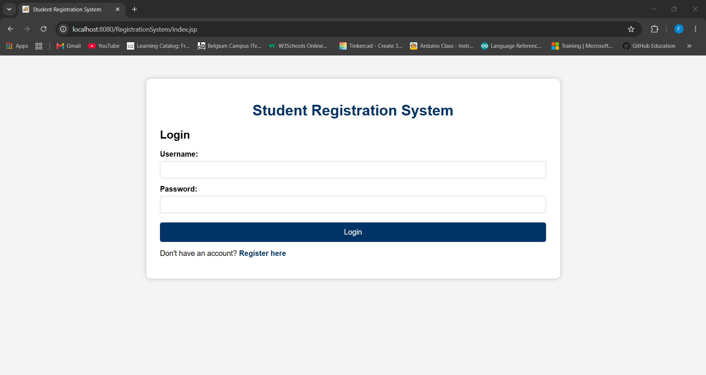
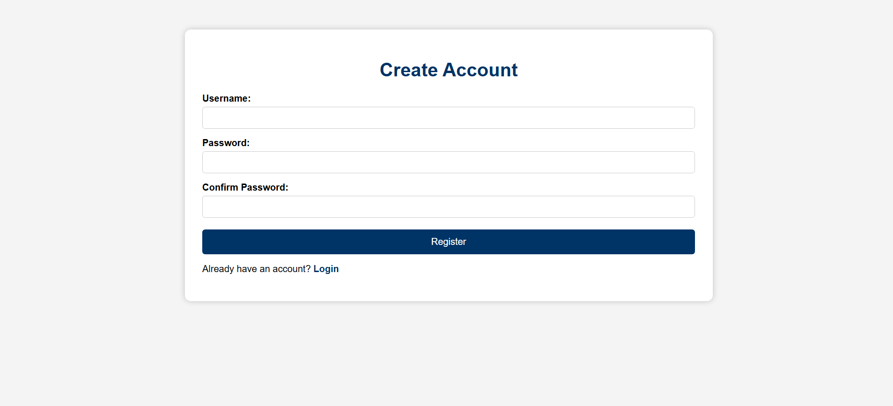
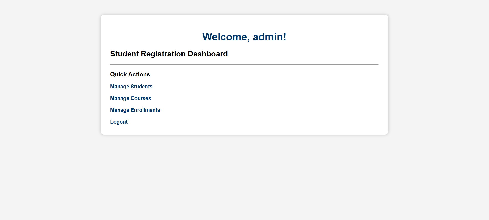
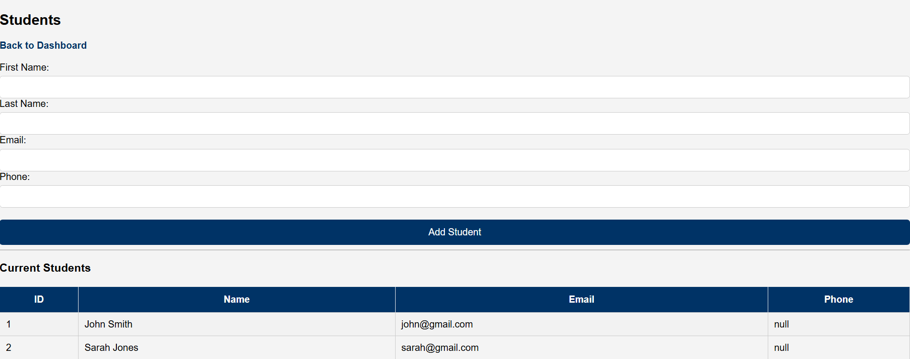
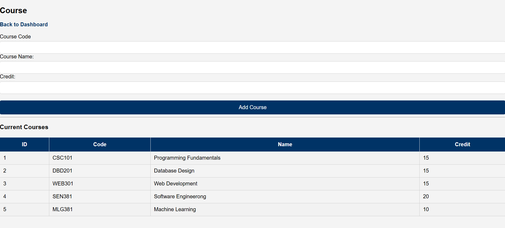
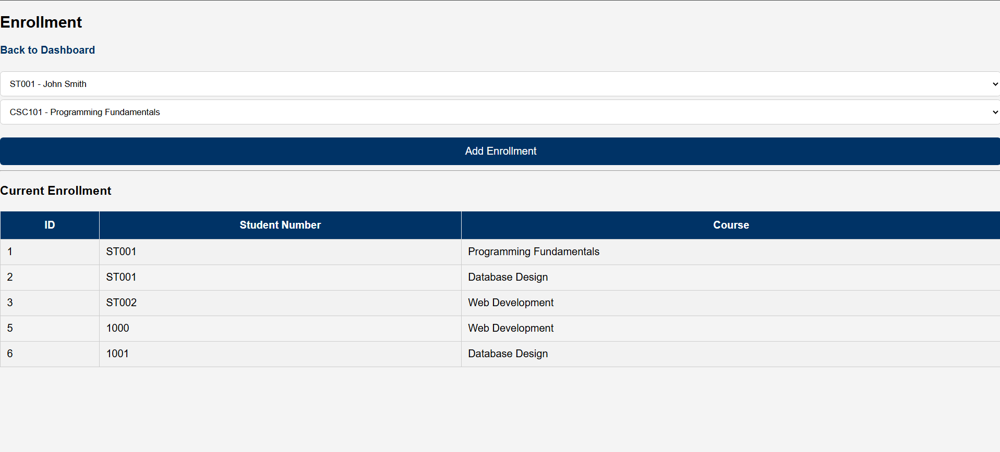

# Student Registration System

A Java EE based web application developed to manage student registrations, courses, and enrollments. The system provides user authentication, student management, course management, and enrollment management through a web-based interface.

The project demonstrates the use of Java Servlets, JSP, JDBC, PostgreSQL, and MVC architecture principles.

---

# Features

## User Management
- User registration
- User login authentication
- User logout functionality
- Session-based authentication

## Student Management
- Add new students
- View registered students
- Store student information:
  - Student number
  - First name
  - Last name
  - Email
  - Phone number

## Course Management
- Add courses
- View available courses
- Store course information:
  - Course code
  - Course name
  - Credits

## Enrollment Management
- Enroll students into courses
- Manage student-course relationships
- Display current enrollments
- Uses database foreign key relationships

---

# Technologies Used

## Backend
- Java
- Java Servlets
- JDBC
- MVC Architecture

## Frontend
- JSP (JavaServer Pages)
- HTML5
- CSS

## Database
- PostgreSQL

## Server
- Apache Tomcat 10

## Development Environment
- Apache NetBeans

---

# System Architecture

The project follows an MVC architecture:

```
User Interface (JSP)
        |
        |
Controllers (Servlets)
        |
        |
DAO Layer (Database Operations)
        |
        |
PostgreSQL Database
```

### Model
Contains Java classes representing system entities:

- User
- Student
- Course
- Enrollment

### View
JSP pages responsible for displaying information:

- Login page
- Dashboard
- Student management
- Course management
- Enrollment management

### Controller
Servlets handling requests:

- LoginServlet
- RegisterServlet
- LogoutServlet
- StudentServlet
- CourseServlet
- EnrollmentServlet

---

# Screenshots

## Login Page



---

## Registration Page



---

## Dashboard



---

## Student Management



---

## Course Management



---

## Enrollment Management



---

# Database Setup

The project uses PostgreSQL.

## 1. Create the Database

Create a PostgreSQL database:

```
StudentRegistrationSystem
```

---

## 2. Run SQL Scripts

Navigate to:

```
database/
```

Run:

```
create_database.sql
```

This creates:

- users table
- students table
- courses table
- enrollments table
- constraints
- relationships

Optional:

```
sample_data.sql
```

can be executed to insert example records.

---

# Database Configuration

Update the database connection settings:

Location:

```
src/java/com/student/util/DBConnection.java
```

Update:

```java
private static final String URL =
"jdbc:postgresql://localhost:5432/StudentRegistrationSystem";

private static final String USER = "postgres";

private static final String PASSWORD = "YOUR_PASSWORD";
```

Replace:

```
YOUR_PASSWORD
```

with your local PostgreSQL password.

---

# Running the Application

## Requirements

Install:

- Java JDK 21+
- PostgreSQL
- Apache Tomcat 10
- Apache NetBeans

---

## Steps

### 1. Clone Repository

```bash
git clone https://github.com/FreerkvdB/StudentRegistrationSystem.git
```

---

### 2. Open Project

Open Apache NetBeans:

```
File
→ Open Project
→ Select RegistrationSystem
```

---

### 3. Configure Database

Make sure PostgreSQL is running and update:

```
DBConnection.java
```

with your database credentials.

---

### 4. Configure Tomcat

Add Apache Tomcat server:

```
Tools
→ Servers
→ Add Server
```

Select:

```
Apache Tomcat 10
```

---

### 5. Run Project

In NetBeans:

```
Right Click Project
→ Run
```

The application will open in your browser.

---

# Demo Login Credentials

For testing and demonstration purposes, the application includes a default user account.

| Username | Password |
|----------|----------|
| admin    | admin123 |

Use these credentials on the login page to access the dashboard.

> Note: For a production deployment, passwords should be stored securely using password hashing (for example BCrypt) instead of plain text.

# Database Relationships

The system uses relational database design.

## Students

One student can have multiple enrollments.

```
students
    |
    |
 enrollments
```

## Courses

One course can contain multiple students.

```
courses
    |
    |
 enrollments
```

The enrollment table connects students and courses using foreign keys:

```
student_id → students.student_id

course_id → courses.course_id
```

---

# Future Improvements

Possible improvements:

- Password encryption using BCrypt
- Student search functionality
- Update and delete operations
- Role-based access control
- Improved UI design
- Pagination for large datasets
- REST API integration

---

# Author

Freerk Van Den Bos

Bachelor of Computing  
Software Engineering

---

# License

This project is for educational and portfolio purposes.
